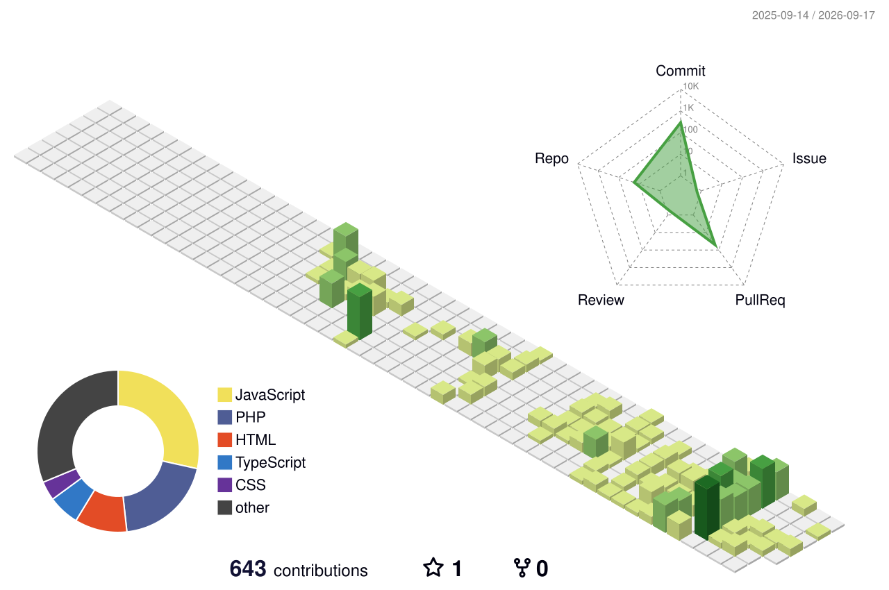

# Hi, I'm Lovepreet Sandhu

## Tech Stack

## Contribution Graph

  <picture>
    <source
      media="(prefers-color-scheme: dark)"
      srcset="https://raw.githubusercontent.com/Lovepreet0199/Lovepreet0199/output/github-contribution-grid-snake-dark.svg"
    />
    <source
      media="(prefers-color-scheme: light)"
      srcset="https://raw.githubusercontent.com/Lovepreet0199/Lovepreet0199/output/github-contribution-grid-snake.svg"
    />
    
  </picture>

## 3D Contribution Graph

## GitHub Streak

  

## Links

